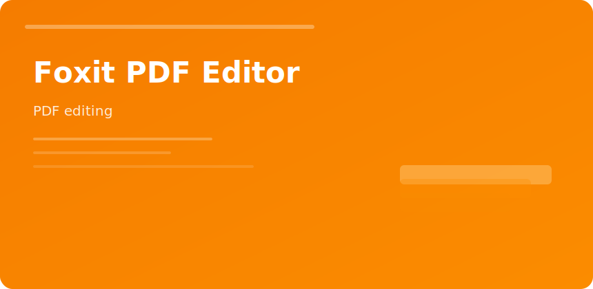

  

  

# Foxit PDF Editor

Lightweight alternative for teams needing **edit + sign + protect** without heavyweight suites.

## Feature grid

| Area | Capability |
|------|------------|
| Edit | Text, images, links |
| Review | Comments, stamps |
| Forms | Create/fill/flatten |
| Protect | Password, cert, redact |
| Compare | Visual diff two PDFs |

## Collaboration

ConnectedPDF tracks versions when org policy allows cloud hooks; air-gapped sites can disable sync entirely.

## Handoff

Export to Word only when client must edit body copy—otherwise keep PDF for layout fidelity.

foxit pdf editor redaction forms enterprise documents
